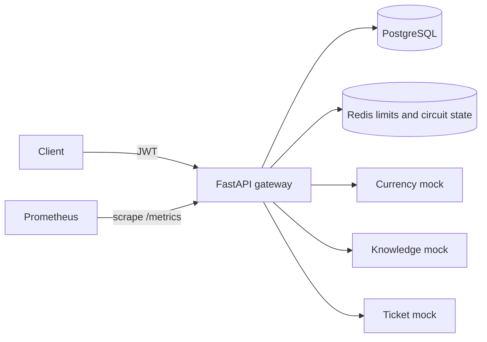
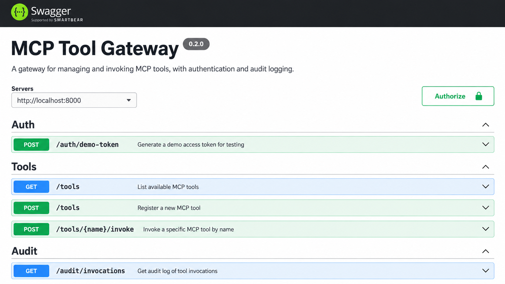
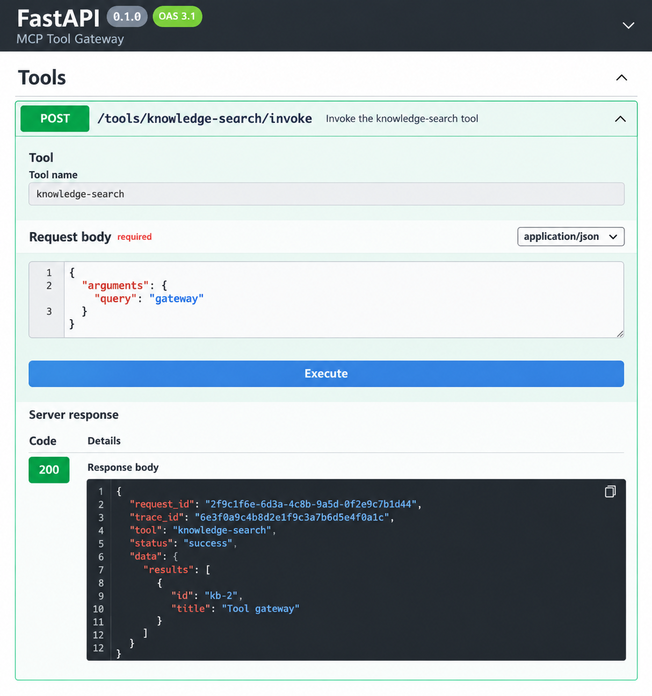
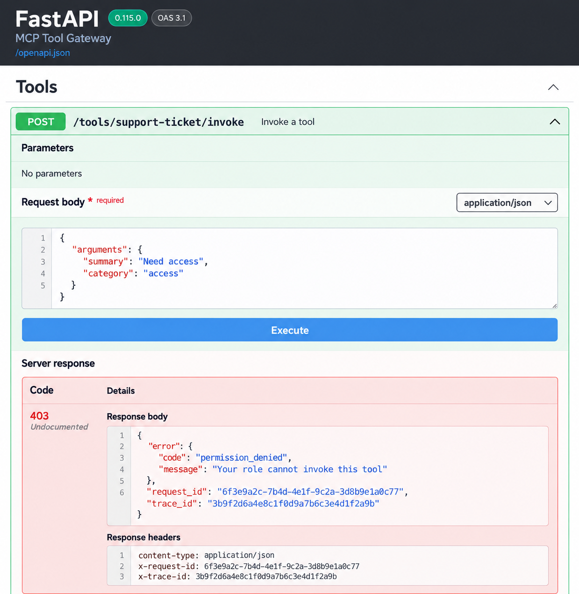
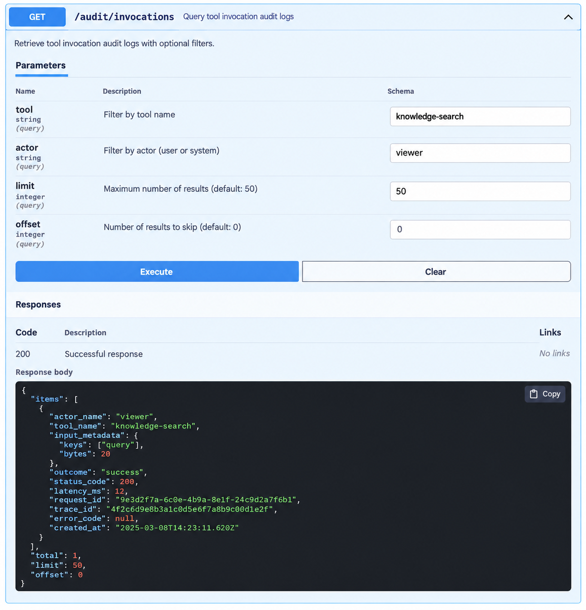
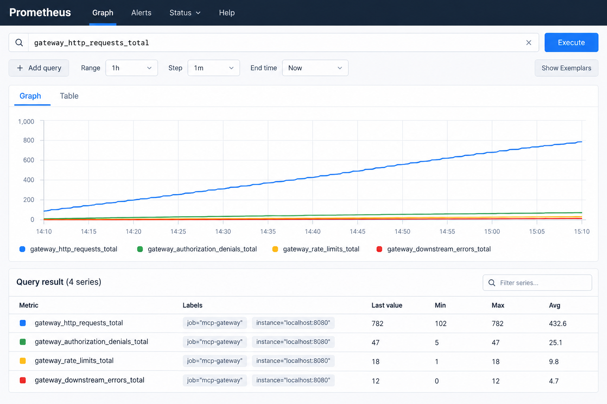
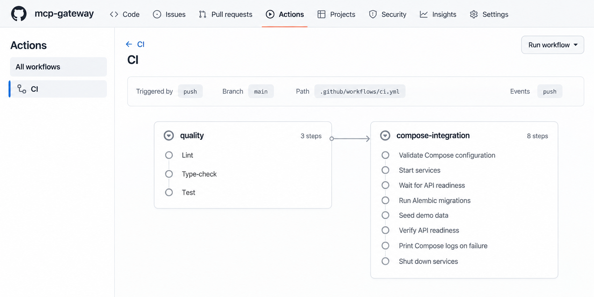

# MCP Tool Gateway

A local, portfolio-oriented gateway for registering safe demo tools, granting role permissions, invoking only approved targets, and auditing each attempt. It uses seeded demo identities and local-only infrastructure; there is no password store or external tool integration.

## Architecture



## Local setup

Requires Docker Compose and Python 3.12. `make setup` creates a local `.env` with random, disposable values for `POSTGRES_PASSWORD`, `JWT_SECRET`, and `DEMO_ACCESS_KEY`, and a matching `DATABASE_URL`. It never overwrites an existing `.env`. Alternatively copy `.env.example` and fill those values yourself; URL-encode the database password in `DATABASE_URL`. Never commit `.env` or use real credentials.

```sh
make setup
make dev
curl http://localhost:8000/health/live
curl http://localhost:8000/health/ready
```

`make dev` builds the stack, applies Alembic migrations, and seeds demo data. OpenAPI docs: [http://localhost:8000/docs](http://localhost:8000/docs). Prometheus: [http://localhost:9090](http://localhost:9090). PostgreSQL and Redis host ports are bound to loopback only; demo tools are available only on the Compose network. On Windows without Make, run `python -m app.core.setup`, `docker compose up --build -d`, `docker compose exec -T api alembic upgrade head`, and `docker compose exec -T api python -m app.db.seeds`.

For local quality checks:

```sh
python -m pip install -e '.[dev]'
make check
```

`make stop` stops the stack without deleting its named volumes. `make migrate` and `make seed` can be rerun; seeding is idempotent. `make format` formats Python files. Never run `docker compose down -v` unless you intend to erase all local data.

## Demo identities and API examples

The seeded users are `admin`, `developer`, and `viewer`. They have no passwords. The locally configured `DEMO_ACCESS_KEY` authorizes minting a short-lived JWT for one of these identities. Treat this key as an administrator bootstrap key because it can mint an admin token. It is deliberately suitable only for a local demo.

```sh
export DEMO_ACCESS_KEY='<value from your .env>'
TOKEN=$(curl -s http://localhost:8000/auth/demo-token \
  -H "X-Demo-Key: $DEMO_ACCESS_KEY" -H 'Content-Type: application/json' \
  -d '{"username":"developer"}' | python -c 'import json,sys; print(json.load(sys.stdin)["access_token"])')

curl -H "Authorization: Bearer $TOKEN" http://localhost:8000/tools
curl -X POST http://localhost:8000/tools/knowledge-search/invoke \
  -H "Authorization: Bearer $TOKEN" -H 'Content-Type: application/json' \
  -d '{"arguments":{"query":"gateway"}}'
```

Admin registry example:

```sh
ADMIN_TOKEN=$(curl -s http://localhost:8000/auth/demo-token \
  -H "X-Demo-Key: $DEMO_ACCESS_KEY" -H 'Content-Type: application/json' \
  -d '{"username":"admin"}' | python -c 'import json,sys; print(json.load(sys.stdin)["access_token"])')
curl -X PUT http://localhost:8000/tools/knowledge-search/permissions/viewer \
  -H "Authorization: Bearer $ADMIN_TOKEN" -H 'Content-Type: application/json' \
  -d '{"role":"viewer","allowed":true}'
curl -H "Authorization: Bearer $ADMIN_TOKEN" \
  'http://localhost:8000/audit/invocations?tool=knowledge-search&limit=20'
```

The admin can create, update, delete, activate, or deactivate tools. `GET /tools/{name}/permissions` shows mappings. `POST /tools/{name}/invoke` is the single execution endpoint. The seeded viewer can call knowledge search but is denied currency conversion and ticket creation. The developer can call all three. The admin has implicit access. Responses carry `request_id` and `trace_id`; errors use `{"error":{"code":"...","message":"..."},"request_id":"...","trace_id":"..."}`.

## Threat model and trade-offs

The main risks are unauthorized calls, server-side request forgery through a registered target, oversized or hostile schemas, downstream outage, and leakage through audit data. JWTs are signed with a local key, tool targets are restricted to three exact internal URLs, schemas reject remote references, inputs are validated, Redis enforces per-user/tool limits and circuit state, and audit records contain only argument names and byte counts. No raw arguments, outputs, passwords, or real secrets are stored. Keep `.env` private and never expose this demo token issuer publicly.

This MVP uses a shared bootstrap key instead of real identity management, a simple expiring counter for limits, in-process OTel spans exported to JSON logs, and fixed mock tool services. Redis is bound to loopback without authentication; the stack is intended for a trusted local machine. Tool output is mocked and support tickets are simulated. See [architecture](docs/architecture.md) and [runbook](docs/runbook.md) for details.

## Project views












